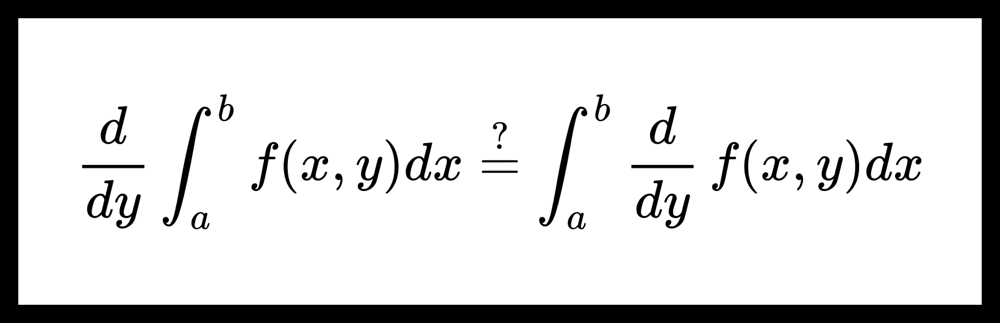

# Дифференцирование собственных интегралов с параметрами.

**Теорема.** О дифференцировании собственных интегралов с параметрами.

Пусть дана функция $ {f(x, y) : [a, b] \times [c, d] \to \mathbb{R} } $. Также пусть выполнено следующее:

1. Существует производная $ f^{\prime}_y (x, y) $, непрерывная в прямоугольнике $ [a, b] \times [c, d] $;

2. $ \forall y \in [c, d] $ функция $ f(x, y) $ непрерывна по $ x $ на интервале $ [a, b] $.

Тогда для $ F(y) = \int_a^b f(x, y) dx $ верно, что

$$ \forall y \in [c, d] \ \ \exists F^{\prime}(y) = \int_a^b f^{\prime}_y (x, y) dx. $$

**Доказательство:**

Пусть $ y_0 \in [c, d] $. Покажем, что $ {\exists F^{\prime}(y_0)} = {\int_a^b f^{\prime}_y (x, y_0) dx} $.

$$ F^{\prime}(y_0) = \lim_{h \to 0} \frac{F(y_0 + h) - F(y_0)}{h} = \lim_{h \to 0} \int_a^b \frac{f(x, y_0 + h) - f(x, y_0)}{h} dx \overset{?}{=} $$

$$ \overset{?}{=} \int_a^b \lim_{h \to 0} \frac{f(x, y_0 + h) - f(x, y_0)}{h} dx = \int_a^b f^{\prime}_y (x, y_0) dx $$

Докажем равенство $ \overset{?}{=} $ используя теорему [о предельном переходе под знаком собственного интеграла](./limits_of_proper_integral.md). Для этого нужно показать, что

$$ \frac{f(x, y_0 + h) - f(x, y_0)}{h} \ \ \overset{x \in [a, b]}{\underset{h \to 0}{\rightrightarrows }} f^{\prime}_y (x, y_0). $$

По теореме Кантора о равномерной непрерывности в силу непрерывности $ f^{\prime}_y $ на $ [a, b] \times [c, d] $ верно следующее:

$$ \forall \varepsilon > 0 \ \ \exists \delta > 0 \ \ \forall x_1, x_2 \in [a, b] \ \ \forall y_1, y_2 \in [c, d] $$

$$ |x_1 - x_2| < \delta, \ \ |y_1 - y_2| < \delta \ \ \Rightarrow \ \ | f^{\prime}_y (x_1, y_1) - f^{\prime}_y (x_2, y_2) | < \varepsilon. $$

Пусть $ x_1 = x_2 = x $, a $ y_1 = y_0 + h $ и $ y_2 = y_0 $.

По формуле Лагранжа найдется $ \theta \in (0, 1) $, что

$$ f^{\prime}_y (x, y_0 + \theta h) = \frac{f(x, y_0 + h) - f(x, y_0)}{h}. $$

Получим

$$ | h | < \delta \ \ \Rightarrow \ \ | \theta h | < \delta \ \ \Rightarrow \ \ | \frac{f(x, y_0 + h) - f(x, y_0)}{h} - f^{\prime}_y (x, y_0) | < \varepsilon. $$

Cумируем:

$$ \forall \varepsilon > 0 \ \ \exists \delta > 0 \ \ \forall x \in [a, b] \ \ \forall h $$

$$ | h | < \delta \ \ \Rightarrow \ \ | \frac{f(x, y_0 + h) - f(x, y_0)}{h} - f^{\prime}_y (x, y_0) | < \varepsilon. $$

Получим, что

$$ \frac{f(x, y_0 + h) - f(x, y_0)}{h} \ \ \overset{x \in [a, b]}{\underset{h \to 0}{\rightrightarrows }} f^{\prime}_y (x, y_0). $$

Что завершает доказательство.