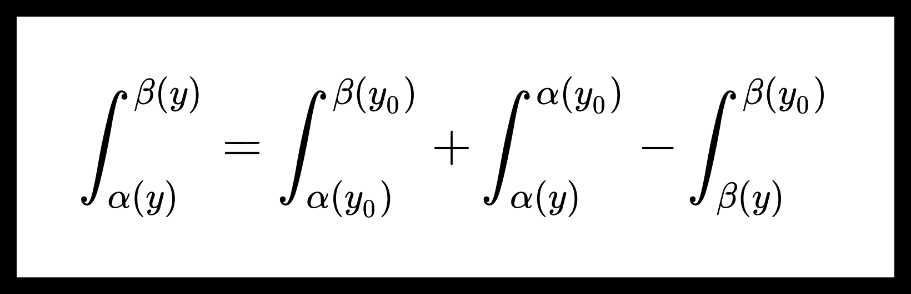

<!-- omit from toc -->
# Непрерывность и дифференцируемость собственных интегралов с параметрами, когда пределы интегрирования зависят от параметров.

[[toc]]

## Непрерывность собственных интегралов с параметрами, когда пределы интегрирования зависят от параметров.

**Теорема.** О непрерывности собственных интегралов с параметрами, когда пределы интегрирования зависят от параметров.

Пусть дана функция $ f(x, y) : {[a, b] \times [c, d]} \to \mathbb{R} $. Также пусть имеются функции $ \alpha(y), \beta(y) $, определенные на $ [c, d] $, а их графики содержаться в $ [a, b] \times [c, d] $.

Функция $ f(x, y) $ непрерывна на $ [a, b] \times [c, d] $. Функции $ \alpha(y), \beta(y) $ непрерывны на $ [c, d] $.

Тогда функция $ \Phi(y) = \int_{\alpha(y)}^{\beta(y)} f(x, y) dx $ непрерывна на $ [c, d] $.

**Доказательство:**

Пусть $ y_0 \in [c, d] $. Покажем, что $ \exists \lim_{y \to y_0} \Phi(y) = \Phi(y_0) $.

$$ \Phi(y) = \int_{\alpha(y_0)}^{\beta(y_0)} f(x, y) dx + \int_{\alpha(y)}^{\alpha(y_0)} f(x, y) dx - \int_{\beta(y)}^{\beta(y_0)} f(x, y) dx. $$

Заметим, что по теореме [о непрерывности собственных интегралов с параметрами](./limits_of_proper_integral.md) интеграл $ \int_{\alpha(y_0)}^{\beta(y_0)} f(x, y) dx $ является непрерывной в точке $ y_0 $ функцией. 

Поэтому для доказательства теоремы, достаточно показать, что интегралы $ \int_{\alpha(y)}^{\alpha(y_0)} f(x, y) dx $ и $ \int_{\beta(y)}^{\beta(y_0)} f(x, y) dx $ являются непрерывными по $ y $ функциями в точке $ y_0 $.

$$ 0 \le \left| \int_{\alpha(y)}^{\alpha(y_0)} f(x, y) dx - \underbrace{\int_{\alpha(y_0)}^{\alpha(y_0)} f(x, y_0) dx}_{=0}  \right| = \left| \int_{\alpha(y)}^{\alpha(y_0)} f(x, y) dx \right| \le $$

$$ \left| \int_{\alpha(y)}^{\alpha(y_0)} \left| f(x, y) \right| dx \right| \le \left| \int_{\alpha(y)}^{\alpha(y_0)} \max_{(x, y) \in [a, b] \times [c, d]} \left| f(x, y) \right| dx \right| = $$

$$ = \left| \alpha(y_0) - \alpha(y) \right| \max_{(x, y) \in [a, b] \times [c, d]} \left| f(x, y) \right| \underset{y \to y_0}{\longrightarrow} 0. $$

Заметим, что по теореме Вейерштрасса максимум достигается, т.к. $ f(x, y) $ непрерывна на компактном множестве $ [a, b] \times [c, d] $.

Получим, что функция $ \int_{\alpha(y)}^{\alpha(y_0)} f(x, y) dx $ непрерывна в $ y_0 $. 

Для $ \int_{\beta(y)}^{\beta(y_0)} f(x, y) dx $ доказательство аналогичное.

Теорема доказана.

$$  $$

## Дифференцируемость собственных интегралов с параметрами, когда пределы интегрирования зависят от параметров.