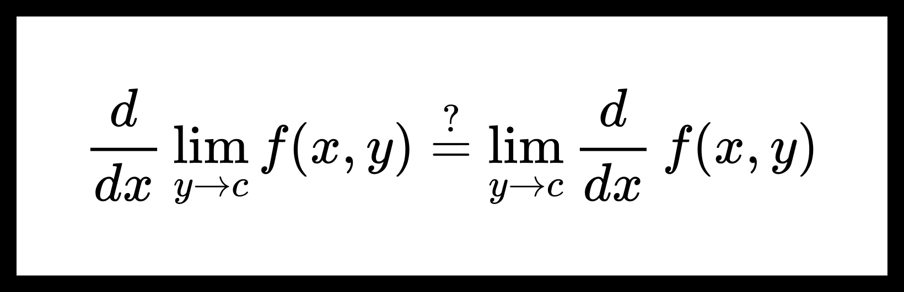

# Дифференцирование пределов

**Теорема.** О дифференцировании пределов функций.

Пусть дана функция $ {f(x, y) : [a, b] \times E \to \mathbb{R} } $, где $ { E \subseteq \mathbb{R} } $. Пусть $ c $ — предельная точка множества $ E $, а также верно следующее:

1. $ { \forall y \in E } $ существует $ \frac{df(x, y)}{dx} $, непрерывная по переменной $ x $ на интервале $ [a, b] $;

2. $ { \frac{df(x, y)}{dx} \overset{x \in [a, b]}{\underset{y \to b}{\rightrightarrows }} \psi(x) } $;

3. $ {\exists x_0 \in [a, b]} \ \ {\exists \lim_{y \to c} f(x_0, y) = \varphi_0} $.

Тогда найдется такая функция $ \varphi(x) $, что:

1. $ f(x, y) \overset{x \in [a, b]}{\underset{y \to b}{\rightrightarrows }} \varphi(x) $;

2. $ {\forall x \in [a, b]} \ \ {\varphi^{\prime}(x) = \psi(x)} $.

**Доказательство:**

Из теоремы [о непрерывности равномерного предела непрерывных функций](./limit_continuity.md) следует, что $ \psi(x) $ непрерывна на $ [a, b] $. Поэтому определена функция

$$ \varphi(x) = \varphi_0 + \int_{x_0}^x \psi(t) dt. $$

Очевидно, что для нее верно заключение $ 2 $.

Покажем, что верно и заключение $ 1 $.

Из условия $ 1 $ теоремы следует, что функцию $ f(x, y) $ можно представить в виде:

$$ f(x, y) = f(x_0, y) + \int_{x_0}^{x} \frac{df(t, y)}{dt} dt. $$

Поэтому верна оценка:

$$ 0 \le \sup_{x \in [a, b]} | f(x, y) - \varphi(x) | \le | f(x_0, y) - \varphi_0 | + \sup_{x \in [a, b]} | \int_{x_0}^{x} \left( \frac{df(t, y)}{dt} - \psi(t) \right) dt |. \tag{1} $$

Заметим, что

$$ \exists \lim_{y \to c} | f(x_0, y) - \varphi_0 | = 0. $$

Теперь рассмотрим второе слогаемое

$$ 0 \le \boxed{\sup_{x \in [a, b]} | \int_{x_0}^{x} \left( \frac{df(t, y)}{dt} - \psi(t) \right) dt |} \le \sup_{x \in [a, b]} | \int_{x_0}^{x} \left| \frac{df(t, y)}{dt} - \psi(t) \right| dt | \le $$

$$ \le \int_{a}^{b} \left| \frac{df(x, y)}{dx} - \psi(x) \right| dx \le \int_{a}^{b} \sup_{x \in [a, b]} \left| \frac{df(x, y)}{dx} - \psi(x) \right| dx = $$

$$ = (b - a) \sup_{x \in [a, b]} \left| \frac{df(x, y)}{dx} - \psi(x) \right| \underset{y \to c}{\longrightarrow} 0. $$

Получим, что существует предел

$$ \exists \lim_{y \to c} \sup_{x \in [a, b]} | \int_{x_0}^{x} \left( \frac{df(t, y)}{dt} - \psi(t) \right) dt | = 0. $$

Из неравенства (1) можем сделать вывод, что 

$$ \exists \lim_{y \to c} \sup_{x \in [a, b]} | f(x, y) - \varphi(x) | = 0 $$

или

$$ f(x, y) \overset{x \in [a, b]}{\underset{y \to b}{\rightrightarrows }} \varphi(x). $$