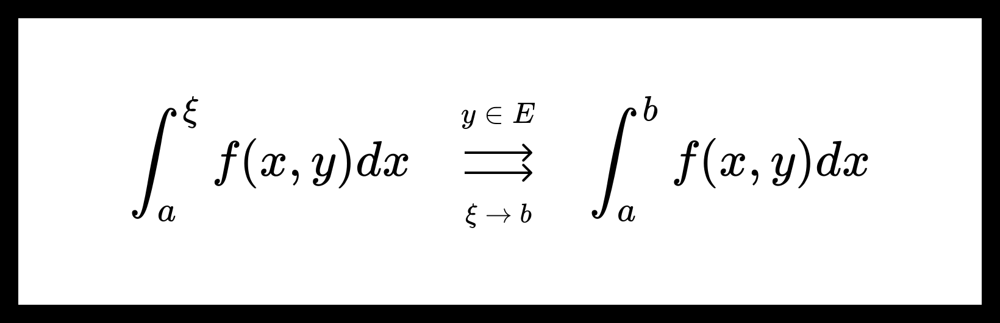

# Равномерная сходимость несобственных интегралов с параметрами. Критерий Коши.

## Равномерная сходимость несобственных интегралов с параметрами.

Пусть дана функция $ {f(x, y) : [a, b) \times E \to \mathbb{R}} $. Также пусть для $ {\forall \xi \in [a, b)} \ \ {\forall y \in E} $ существует интеграл $ \int_a^\xi f(x, y) dx $ в собственном смысле. 

**Определение.** Говорят, что несобственный интеграл $ {\int_a^b f(x, y) dx} $ сходится **поточечно** на множестве $ E $, если существует функция $ \psi(y) $, для которой

$$ \int_a^\xi f(x, y) dx \ \ \overset{y \in E}{\underset{\xi \to b}{\longrightarrow}} \ \ \psi(y).  $$

**Определение.** Говорят, что несобственный интеграл $ {\int_a^b f(x, y) dx} $ сходится **равномерно** на множестве $ E $, если существует функция $ \psi(y) $, для которой

$$ \int_a^\xi f(x, y) dx \ \ \overset{y \in E}{\underset{\xi \to b}{\rightrightarrows  }} \ \ \psi(y).  $$

---

Предельную функцию $ \psi(y) $ обозначают как

$$ \int_a^b f(x, y) dx := \psi(y). $$

---

## Критерий Коши.

**Теорема.** Критерий Коши равномерной сходимости несобственного интеграла с параметрами.

Пусть дана функция $ {f(x, y) : [a, b) \times E \to \mathbb{R}} $. Также пусть для $ {\forall \xi \in [a, b)} \ \ {\forall y \in E} $ существует интеграл $ \int_a^\xi f(x, y) dx $ в собственном смысле. 

Несобственный интеграл $ {\int_a^b f(x, y) dx} $ сходится **равномерно** на множестве $ E $ тогда и только тогда, когда

$$ \forall \varepsilon > 0 \ \ \exists A_\varepsilon \in (a, b) \ \ \forall \xi_1, \xi_2 \in (A_\varepsilon, b) \ \ \forall y \in E $$

$$ \left| \int_{\xi_1}^{\xi_2} f(x, y) dx \right| < \varepsilon. $$

**Доказательство:**

Достаточно сослаться на [Критерий Коши равномерной сходимости функции](uniform_convergence.md), рассмотрев равномерную сходимость функции

$$ F(\xi, y) = \int_a^{\xi} f(x, y) dx. $$