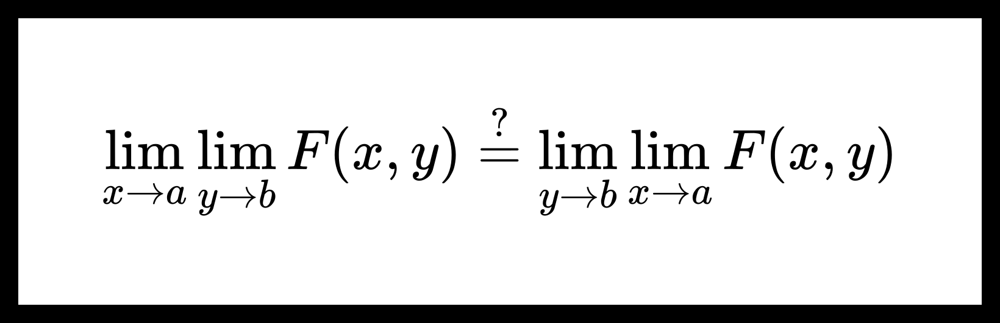

# Теорема о равенстве повторных пределов.

> Повторные пределы возникают, когда мы последовательно вычисляем пределы функции по разным переменным. Вопрос о равенстве таких пределов важен в анализе, особенно при работе с несобственными интегралами и рядами. Теорема о равенстве повторных пределов устанавливает условия, при которых порядок взятия пределов можно менять.

**Теорема.** О равенстве повторных пределов.

Пусть $ D \subseteq \mathbb{R}^p, E \subseteq \mathbb{R}^p $. Функция $ {F : D \times E \to \mathbb{R}^s} $. Пусть $ a $ — предельная точка множества $ D $, а $ b $ — предельная точка множества $ E $. Также пусть выполнено следующее:

1. $ {\forall y \in E} \ \ {\exists \lim_{x \to a}} F(x, y) = \psi(y) $;

2. $ F(x, y) \overset{x \in D}{\underset{y \to b}{\rightrightarrows }} \varphi(x). $

Тогда 

$$ {\exists \lim_{y \to b} \psi(y)}, {\exists \lim_{x \to a} \varphi(x)} \ \ \text{и} \ \ {\lim_{y \to b} \psi(y)} = {\lim_{x \to a} \varphi(x)}. $$

**Доказательство:**

Пусть верно условие теоремы, тогда выполнено

1. Условие Коши равномерной сходимости

    $$ {\forall \varepsilon > 0} \ \ {\exists \overset{\circ}{U}_b} \ \ {\forall y_1, y_2 \in \overset{\circ}{U}_b \cap E} \ \ {\forall x \in D} \ \ \| F(x, y_1) - F(x, y_2) \| < \frac{\varepsilon}{3} \tag{1} $$

2. Условие поточечной сходимости при $ x \to a $

    $$ {\forall y \in E} \ \ {\forall \varepsilon > 0} \ \ {\exists \overset{\circ}{V}_a} \ \ {\forall x \in \overset{\circ}{V}_a \cap D} \ \ {\| F(x, y) - \psi(y) \| < \frac{\varepsilon}{3}} \tag{2} $$

3. Условие поточечной сходимости при $ y \to b $

    $$ {\forall x \in D} \ \ {\forall \varepsilon > 0} \ \ {\exists \overset{\circ}{U}_b} \ \ {\forall y \in \overset{\circ}{U}_b \cap E} \ \ {\| F(x, y) - \varphi(x) \| < \varepsilon} \tag{3} $$

---

_Шаг 1_. Покажем, что $ {\exists \lim \psi(y)} $.

Из утверждений $ (1), (2) $ можно заключить, что $ \boxed{\forall \varepsilon > 0} $

$$ \boxed{{\exists \overset{\circ}{U}_b} \ \ {\forall y_1, y_2 \in \overset{\circ}{U}_b \cap E}} \ \ {\exists \overset{\circ}{V^{1}_a}} \ \ {\exists \overset{\circ}{V^{2}_a}} \ \ {\forall x \in \overset{\circ}{V^{1}_a} \cap \overset{\circ}{V^{2}_a} \cap D} $$

$$ \| F(x, y_1) - \psi(y_1) \| < \frac{\varepsilon}{3}, \ \ \| F(x, y_2) - \psi(y_2) \| < \frac{\varepsilon}{3}, $$

$$ \| F(x, y_1) - F(x, y_2) \| < \frac{\varepsilon}{3}. $$

Поэтому

$$ \| \psi(y_1) - \psi(y_2) \| = \| \left[ \psi(y_1) - F(x, y_1) \right] - \left[ \psi(y_2) - F(x, y_2) \right] + \left[ F(x, y_1) - F(x, y_2) \right] \| \le $$

$$ \le \| \psi(y_1) - F(x, y_1)\| + \| \psi(y_2) - F(x, y_2) \| + \| F(x, y_1) - F(x, y_2) \| < $$

$$ < \frac{\varepsilon}{3} + \frac{\varepsilon}{3} + \frac{\varepsilon}{3} = \varepsilon. $$

Получим, что

$$ \boxed{\| \psi(y_1) - \psi(y_2) \| < \varepsilon} \ . $$

Для $ \psi(y) $ выполнено условие Коши существования предела, поэтому

$$ \exists \lim_{y \to b} \psi(y). $$

---

_Шаг 2._ Покажем, что $ {\exists \lim \varphi(x)} = \lim \psi(y) $.

Пусть $ A = \lim \psi(y) $, тогда

<!-- $$ {\forall \varepsilon > 0} \ \ {\exists \overset{\circ}{V}_a} \ \ {\forall x \in  \overset{\circ}{V}_a \cap D} \ \ {\| F(x, y) - \psi(y) \| < \varepsilon}. \tag{4} $$ -->

$$ {\forall \varepsilon > 0} \ \ {\exists \overset{\circ}{U}_b} \ \ {\forall y \in  \overset{\circ}{U}_b \cap E} \ \ {\| \psi(y) - A \| < \varepsilon}. \tag{4} $$

Из $ (2), (3), (4) $ можем получить следующее

$$ \boxed{{\forall \varepsilon > 0} \ \ {\exists \overset{\circ}{V}_a} \ \ {\forall x \in  \overset{\circ}{V}_a \cap D}} \ \ {\exists \overset{\circ}{U^{1}_b}} \ \ {\exists \overset{\circ}{U^{2}_b}} \ \ {\forall y \in \overset{\circ}{U^{1}_b} \cap \overset{\circ}{U^{2}_b} \cap D} $$

$$ \| F(x, y) - \psi(y) \| < \frac{\varepsilon}{3}, \ \ \| F(x, y) - \varphi(x) \| < \frac{\varepsilon}{3}, \ \ {\| \psi(y) - A \|} < \frac{\varepsilon}{3}. $$

Поэтому

$$ {\| \varphi(x) - A \|} = {\| [\varphi(x) - F(x, y)] - [\psi(y) - F(x, y)] + [\psi(y) - A] \|} \le $$

$$ \le \| F(x, y) - \varphi(x) \| + \| F(x, y) - \psi(y) \| + {\| \psi(y) - A \|} < $$

$$ < \frac{\varepsilon}{3} + \frac{\varepsilon}{3} + \frac{\varepsilon}{3} = \varepsilon. $$

Получим, что

$$ \boxed{\| \varphi(x) - A \| < \varepsilon} \ . $$

Можем заключить, что

$$ \exists \lim_{x \to a} \varphi(x) = A. $$

---