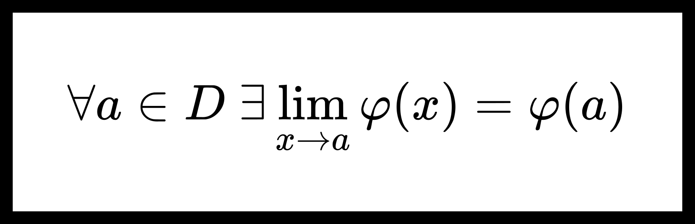

<!-- omit from toc -->
# Равномерный предел непрерывных функций.

[[toc]]

## Теорема о непрерывности равномерного предела непрерывных функций.

**Теорема.** О непрерывности равномерного предела непрерывных функций.

Пусть $ D \subseteq \mathbb{R}^p $, $ E \subseteq \mathbb{R}^q $, а $ b $ — предельная точка множества $ E $. Пусть дана функция $ {F(x, y) : D \times E \to \mathbb{R}^s } $, для которой верно:

1. $ {\forall y \in E} $ функция $ F(x, y) $ непрерывна по $ x $ в $ D $;

2. $ F(x, y) \overset{x \in D}{\underset{y \to b}{\rightrightarrows }} \varphi(x) $.

Тогда функция $ \varphi(x) $ непрерывна в $ D $.

**Доказательство:**

Пусть $ {a \in D} $. Покажем, что $ \exists \lim_{x \to a} \varphi(x) = \varphi(a) $.

Из условий теоремы:

1. $ {\forall y \in E} \ \ {\exists \lim_{x \to a} F(x, y) = F(a, y)} $;

2. $ F(x, y) \overset{x \in D}{\underset{y \to b}{\rightrightarrows }} \varphi(x) $.

Получим, что для $ F(x, y) $ выполнены условия [теоремы о равенстве повторных пределов](iterated_limits.md), поэтому существуют и равны повторные пределы

$$ \lim_{x \to a} \lim_{y \to b} F(x, y) = \lim_{y \to b} \lim_{x \to a} F(x, y). $$

Из утверждений $ 1, 2 $ также следует, что

$$ \lim_{x \to a} \lim_{y \to b} F(x, y) = \lim_{x \to a} \varphi(x), $$

$$ \lim_{y \to b} \lim_{x \to a} F(x, y) = \lim_{y \to b} F(a, y) = \varphi(a). $$

Можем заключить, что 

$$ \exists \lim_{x \to a} \varphi(x) = \varphi(a). $$

### Непрерывность равномерного предела функциональной последовательности.

**Следствие 1.** Непрерывность равномерного предела функциональной последовательности. 

Пусть $ \{ f_n(x) \}_{n=1}^{\infty} $ — функциональная последовательность из непрерывных на множестве $ D $ функций. 

Тогда, если $ f_n(x) \overset{x \in D}{\underset{n \to \infty}{\rightrightarrows }} \varphi(x) $, то предел $ \varphi(x) $ — непрерывная на множестве $ D $ функция.

### Непрерывность суммы равномерно сходящегося ряда.

**Следствие 2.** Непрерывность суммы равномерно сходящегося ряда.

$$ \sum_{n=1}^{\infty} f_n(x). \tag{1} $$

Если функциональный ряд $ (1) $ сходиться равномерно в $ D $, а $ {\{ f_n(x) \}_{n=1}^{\infty}} $ — непрерывные в $ D $ функции, то сумма ряда $ (1) $ есть непрерывная функция.