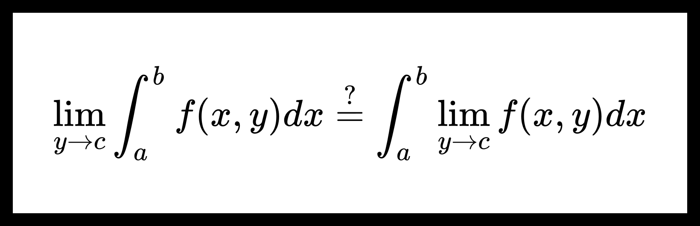

<!-- omit from toc -->
# Предельный переход под знаком собственного интеграла. Непрерывность собственных интегралов с параметрами.

[[toc]]

## Критерий интегрируемости функции.

Вспомним теорему из 1 семестра мат. анализа.

**Теорема.** Критерий интегрируемости функции по Риману.

Функция $ f(x) $ интегрируема по Риману на интервале $ [a, b] $ тогда и только тогда, когда $ {\forall \varepsilon > 0} \ \ {\exists \delta > 0} $, что для любого разбиения $ \tau $ интервала $ [a, b] $, такого, что $ d(\tau) < \varepsilon $, верно, что

$$ \sum_{n=0}^{N(\tau)} \omega_{n,\tau} \Delta x^{\tau}_n < \varepsilon, $$

где $ N(\tau) $ — кол-во интервалов разбиения, $ x^{\tau}_n $ — узлы разбиения, такие, что $ a = x^{\tau}_0 < x^{\tau}_1 < \dots < x^{\tau}_{N(\tau)} = b $, $ \Delta x^{\tau}_n = x^{\tau}_n - x^{\tau}_{n-1} $ — длина $ n $-го интервала, $ d(\tau) = \max \Delta x^{\tau}_n $ — диаметр разбиения $ \tau $, 

$$ \omega_{n, \tau} = \sup_{x^{\prime}, x^{\prime \prime} \in [x^{\tau}_{n-1}, x^{\tau}_n]} | f(x^{\prime}) - f(x^{\prime \prime}) |. $$

## Предельный переход под знаком собственного интеграла.

**Теорема.** О предельном переходе под знаком собственного интеграла.

Пусть $ {f(x, y) : [a, b] \times E \to \mathbb{R}} $, где $ E \subseteq \mathbb{R}^s $. Также пусть верно следующее:

1. $ {\forall y \in E} $ функция $ f(x, y) $ интегрируема по Риману на интервале $ [a, b] $;

2. $ f(x, y) \overset{x \in [a, b]}{\underset{y \to c}{\rightrightarrows }} \varphi(x) $.

Тогда функция $ \varphi(x) $ интегрируема по Риману на интервале $ [a, b] $ и существует предел:

$$ \lim_{y \to c} \int_{a}^{b} f(x, y) dx = \int_{a}^{b} \varphi(x) dx. \tag{1} $$

**Доказательство:**

*Шаг 1.* Докажем, что $ \varphi(x) $ интегрируема по Риману на интервале $ [a, b] $.

Для этого покажем, что для $ \varphi(x) $ выполняется условие критерия интегрируемости функции по Риману.

Пусть $ \tau $ — разбиение интервала $ [a, b] $.

Выберем произвольные $ {x^{\prime}, x^{\prime \prime} \in [a, b]} $ и $ {y \in E} $, тогда

$$ | \varphi(x^{\prime}) - \varphi(x^{\prime \prime}) | \le | \varphi(x^{\prime}) - f(x^{\prime}, y) | + | \varphi(x^{\prime \prime}) - f(x^{\prime \prime}, y) | + $$

$$ + | f(x^{\prime}, y) - f(x^{\prime \prime}, y) | $$

Из этой оценки можем получить следующее:

$$ \sum_{n=0}^{N(\tau)} \omega^{\varphi}_{n, \tau} \Delta x_n \le \sum_{n=0}^{N(\tau)} \omega^{f}_{n, \tau} \Delta x_n + 2 \sup_{x \in [a, b]} \left| \varphi(x) - f(x, y) \right| \underbrace{\sum_{n=0}^{N(\tau)} \Delta x_n}_{b-a}, \tag{2} $$

где 

$$ \omega_{n, \tau}^{\varphi} = \sup_{x^{\prime}, x^{\prime \prime} \in [x^{\tau}_{n-1}, x^{\tau}_n]} | \varphi(x^{\prime}) - \varphi(x^{\prime \prime}) |,  $$

$$ \omega_{n, \tau}^{f} = \sup_{x^{\prime}, x^{\prime \prime} \in [x^{\tau}_{n-1}, x^{\tau}_n]} | f(x^{\prime}, y) - f(x^{\prime \prime}, y) |. $$

Выберем $ \boxed{\varepsilon > 0} $.

Из условия $ 2 $ теоремы $ {\exists \overset{\circ}{U}_c} $, что для $ {\forall y \in \overset{\circ}{U}_c \cap E } $

$$ \sup_{x \in [a, b]} \left| \varphi(x) - f(x, y) \right| < \frac{\varepsilon}{3 (b - a)}. $$

Также из условия $ 1 $ теоремы следует, что для $ f(x, y) $ верно усовие критерия интегрируемости функции по Риману, поэтому $ \boxed{\exists \delta > 0} $, что $ \boxed{\forall \tau} $ верно, что если $ \boxed{d(\tau) < \delta} $, то

$$ \sum_{n=0}^{N(\tau)} \omega^{f}_{n, \tau} \Delta x_n < \frac{\varepsilon}{3}. $$

Из неравенства $ (2) $ следует, что

$$ \sum_{n=0}^{N(\tau)} \omega^{\varphi}_{n, \tau} \Delta x_n < \frac{\varepsilon}{3} + \frac{2 \varepsilon}{3 (b - a)} (b - a) = \varepsilon. $$

Получим

$$ \boxed{\sum_{n=0}^{N(\tau)} \omega^{\varphi}_{n, \tau} \Delta x_n < \varepsilon} \ . $$

*Шаг 2.* Докажем существование предела $ (1) $.

В шаге $ 1 $ мы доказали существование собственного интеграла $ \int_a^b \varphi(x) dx $. Поэтому $ \forall y \in E $ верно следующее

$$ 0 \le \left| \int_a^b f(x, y) dx - \int_a^b \varphi(x) dx \right| \le \int_a^b \left| f(x, y) - \varphi(x) \right| dx \le $$

$$ = \int_a^b \sup_{x \in [a, b]} \left| f(x, y) - \varphi(x) \right| dx = (b - a) \sup_{x \in [a, b]} \left| f(x, y) - \varphi(x) \right| $$

Из условия $ 2 $ теоремы

$$ \exists \lim_{y \to c} \sup_{x \in [a, b]} \left| f(x, y) - \varphi(x) \right| = 0, $$

поэтому

$$ \exists \lim_{y \to c} \int_a^b f(x, y) dx = \int_a^b \varphi(x) dx $$

Теорема доказана.

## Непрерывность собственных интегралов с параметрами.

**Теорема.** О непрерывности собственных интегралов с параметрами.

Пусть дана функция $ {f(x, y) : [a, b] \times [c, d] \to \mathbb{R}} $. Также пусть $ f(x, y) $ непрерывна на $ {[a, b] \times [c, d]} $. 

Тогда функция $ F(y) = \int_a^b f(x, y) dx $ непрерывна на $ [c, d] $.

**Доказательство:**

Покажем, что $ {\forall y_0 \in [c, d]} \ \ {\exists \lim_{y \to y_0} F(y) = F(y_0).} $

Пусть $ y_0 \in [c, d] $.

1. Из того, что $ f(x, y) $ непрерывна на $ {[a, b] \times [c, d]} $ имеем, что $ {\forall y \in [c, d]} $ функция $ f(x, y) $ как функция от $ x $ непрерывна на $ [a, b] $.

    Поэтому $ \forall y \in [c, d] $ существует собственный интеграл $ \int_a^b f(x, y) dx $;

2. По теореме Кантора о равномерной непрерывности, функция $ f(x, y) $ равномерно непрерывна на множестве $ {[a, b] \times [c, d]} $, т.е.

    $$ \forall \varepsilon > 0 \ \ \exists \delta > 0 \ \ \forall x_1, x_2 \in [a, b] \ \ \forall y_1, y_2 \in [c, d] $$

    $$ | x_1 - x_2 | < \delta, \ \ | y_1 - y_2 | < \delta \ \ \Rightarrow \ \ | f(x_1, y_1) - f(x_2, y_2) | < \varepsilon. $$

    Тогда положив $ x_1 = x_2 = x $ и $ y_1 = y, y_2 = y_0 $, получим

    $$ \forall \varepsilon > 0 \ \ \exists \delta > 0 \ \ \forall y \in [c, d] \ \ \forall x \in [a, b] $$

    $$ | y - y_0 | < \delta \ \ \Rightarrow \ \ | f(x, y) - f(x, y_0) | < \varepsilon. $$

    Значит

    $$ f(x, y) \overset{x \in [a, b]}{\underset{y \to y_0}{\rightrightarrows }} f(x, y_0). $$

Получим, что выполняются условия теоремы о предельном переходе под знаком собственного интеграла, значит

$$ \exists \lim_{y \to y_0} \int_a^b f(x, y) dx = \int_a^b \lim_{y \to y_0} f(x, y) dx = \int_a^b f(x, y_0) dx. $$

Или

$$ \exists \lim_{y \to y_0} F(y) = F(y_0). $$

