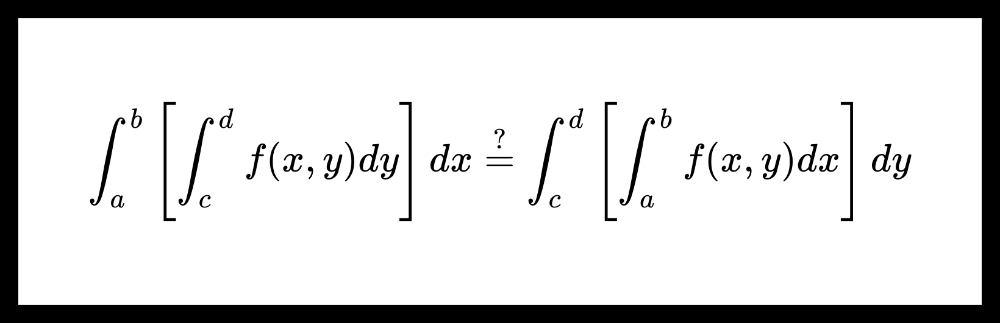

# Перестановка собственных интегрирований.

**Теорема.** О перестановке собственных интегрирований.

Пусть $ {f(x, y) : [a, b] \times [c, d] \to \mathbb{R}} $ непрерывна на множестве $ {[a, b] \times [c, d]} $.

Тогда

$$ \int_a^b \left[ \int_c^d f(x, y) dy \right] dx = \int_c^d \left[ \int_a^b f(x, y) dx \right] dy. $$

**Доказательство:**

Введем обозначения:

$$ I(\xi) = \int_a^b \left[ \int_c^\xi f(x, y) dy \right] dx; \ \ J(\xi) = \int_c^\xi \left[ \int_a^b f(x, y) dx \right] dy; $$

$$ \varphi(x, \xi) = \int_c^\xi f(x, y) dy. $$

*Шаг 1.* Покажем, что $ {\forall \xi \in [c, d]} \ \ {\dfrac{d}{d \xi} I(\xi)} = {\dfrac{d}{d \xi} J(\xi)} $.

1. По теореме о функции переменного верхнего предела 

    $$ \exists \ {\frac{d}{d \xi} J(\xi)} = \frac{d}{d \xi} \int_c^\xi \left[ \int_a^b f(x, y) dx \right] dy = \int_a^b f(x, \xi) dx. $$

2. Заметим, что

    $$ \exists \frac{d}{d \xi} \varphi(x, \xi) = \frac{d}{d \xi} \int_c^\xi f(x, y) dy = f(x, \xi), $$

    где $ f(x, \xi) $ непрерывна на $ [a, b] \times [c, d] $ (по условию теоремы).

    Также $ \forall \xi \in [c, d] \ \ \varphi(x, \xi) $ непрерывна по $ x $ на $ [a, b] $.

    Тогда по [теореме о дифференцировании собственных интегралов с параметрами](diff_of_proper_integral_1.md)

    $$ \exists \frac{d}{d \xi} I(\xi) = \frac{d}{d \xi} \int_a^b \varphi(x, \xi) dx = \int_a^b \frac{d}{d \xi} \varphi(x, \xi) dx = $$

    $$ = \int_a^b f(x, \xi) dx. $$

Получим, что $ {\dfrac{d}{d \xi} I(\xi)} = \int_a^b f(x, \xi) dx = {\dfrac{d}{d \xi} J(\xi)} $.

*Шаг 2.* Докажем теорему, показав, что $ I(d) = J(d) $.

Из утверждения, доказанного в шаге 1, следует, что

$$ \exists C \in \mathbb{R} \ \ \forall \xi [c, d] \ \ I(\xi) = J(\xi) + C. $$

Убедимся, что $ C = 0 $:

$$ I(c) = \int_a^b \left[ \underbrace{\int_c^c f(x, y) dy}_{=0} \right] dx = 0,  $$

$$ J(c) = \underbrace{\int_c^c \left[ \int_a^b f(x, y) dx \right] dy}_{=0} = 0, $$

поэтому

$$ C = I(c) - J(c) = 0. $$

Тогда при $ \xi = d $

$$ I(d) = J(d) $$

или

$$ \int_a^b \left[ \int_c^d f(x, y) dy \right] dx = \int_c^d \left[ \int_a^b f(x, y) dx \right] dy. $$