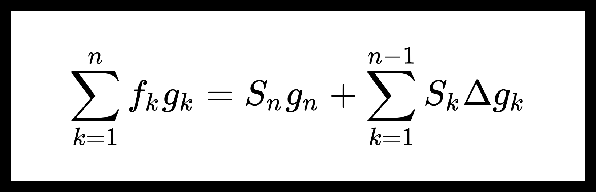

<!-- omit from toc -->
# Признаки равномерной сходимости рядов.

[[toc]]

Пусть дана функциональная последовательность $ { \{ f_n (x) \}_{n=1}^{\infty} } $, где $ {f_n : D \to \mathbb{R}}, \ D \subseteq \mathbb{R^s} $.

## Критерий Коши равномерной сходимости ряда.

**Теорема.** [Критерий Коши равномерной сходимости ряда.](./uniform_convergence.md)

$$ \sum_{k=1}^{\infty} f_k (x) \tag{1} $$

Для того, чтобы ряд $ (1) $ сходился равномерно в $ D $ необходимо и достаточно, чтобы:

$$ {\forall \varepsilon > 0} \ \ {\exists n_0 \in \mathbb{N}} \ \ {\forall n \ge n_0} \ \ {\forall m \ge 1} \ \ \boxed{\forall x \in D} \ \ {\left| \sum_{k=n+1}^{n+m} f_k(x) \right| < \varepsilon}. $$

## Необходимое условие равномерной сходимости ряда.

**Лемма.** Необходимое условие равномерной сходимости ряда.

Пусть ряд $ (1) $ сходиться равномерно в $ D $, тогда

$$ f_n(x) \overset{x \in D}{\underset{n \to \infty}{\rightrightarrows }} 0. $$

**Доказательство:**

Введем обозначение

$$ S_n(x) = \sum_{k=1}^{n} f_k(x). $$

Тогда

$$ 0 \le \sup_{x \in D} | f_n (x) | = \sup_{x \in D} | S_n(x) - S_{n-1}(x) | \le $$

$$ \le \sup_{x \in D} | S_n (x) - \sum_{k=1}^{\infty} f_k (x) | + \sup_{x \in D} | S_{n-1} (x) - \sum_{k=1}^{\infty} f_k (x) | \underset{n \to \infty}{\longrightarrow} 0. $$

Получим, что

$$ \exists \lim_{n \to \infty} \sup_{x \in D} | f_n(x) | = 0, $$

отсюда

$$ f_n(x) \overset{x \in D}{\underset{n \to \infty}{\rightrightarrows }} 0. $$

## Признак Вейерштрасса равномерной сходимости ряда.

**Теорема.** Признак Вейерштрасса равномерной сходимости ряда.

Пусть даны две последовательности: $ { \{ f_n(x) \}_{n=1}^{\infty} } $, $ { \{ g_n(x) \}_{n=1}^{\infty} } $, где $ { f_n : D \to R }, \ \ { g_n : D \to R }, \ \ { D \subseteq \mathbb{R}^s } $. Также пусть выполнено:

1. $ {\exists n_0 \in \mathbb{N} } \ \ {\forall x \in D} \ \ {\forall n \ge n_0} \ \ | f_n(x) | \le g_n (x) $;

2. Ряд $ \sum g_n (x) $ сходиться равномерно в $ D $.

Тогда ряд $ \sum f_n (x) $ сходиться равномерно в $ D $.

**Доказательство.**

Для $ \sum g_n(x) $ верено условие Коши:

$$ \boxed{\forall \varepsilon > 0} \ \ {\exists n_1 \in \mathbb{N}} \ \ {\forall n \ge n_1} \ \ {\forall m \ge 1} \ \ {\forall x \in D} \ \ {\left| \sum_{k=n+1}^{n+m} g_k(x) \right| < \varepsilon}. $$

Тогда $ \boxed{\exists n_2} = \max \{n_0, n_1\} $, что

$$ \boxed{{\forall n \ge n_2} \ \ {\forall m \ge 1} \ \ {\forall x \in D}} $$

$$ {\left| \sum_{k=n+1}^{n+m} f_k(x) \right|} \le {\sum_{k=n+1}^{n+m} \left| f_k(x) \right|} \le {\sum_{k=n+1}^{n+m} \left| g_k(x) \right|} < \varepsilon. $$

Получим, что

$$ \boxed{ {\left| \sum_{k=n+1}^{n+m} f_k(x) \right|} < \varepsilon} \ . $$

Для $ \sum f_n(x) $ верно условие Коши, поэтому ряд $ \sum f_n(x) $ сходиться равномерно в $ D $.

## Тождество Абеля.

**Лемма.** Тождество Абеля.

Пусть даны две последовательности: $ { \{ f_n \}_{n=1}^{\infty} } $, $ { \{ g_n \}_{n=1}^{\infty} } $. Введем обозначения:

$$ S_n = \sum_{k=1}^{n} f_k; \ \ \Delta g_k = g_k - g_{k+1}. $$

Тогда верно тождество

$$ \sum_{k=1}^{n} f_k g_k = S_n g_n + \sum_{k=1}^{n-1} S_k \Delta g_k. $$

**Доказательство:**

$$ \boxed{\sum_{k=1}^{n} f_k g_k} = \sum_{k=1}^{n} (S_k - S_{k-1}) g_k = \sum_{k=1}^{n} S_k g_k - \sum_{k=1}^{n} S_{k-1} g_k = $$

$$ = \sum_{k=1}^{n} S_k g_k - \sum_{k=0}^{n-1} S_{k} g_{k+1} = S_n g_n + \underbrace{S_0}_{=0} g_1 + \sum_{k=1}^{n - 1} S_k (g_k - g_{k+1}) = $$

$$ \boxed{S_n g_n + \sum_{k=1}^{n - 1} S_k \Delta g_k} \ . $$

## Признак Дирихле.

**Теорема.** Признак Дирихле.

Пусть даны две последовательности: $ { \{ f_n(x) \}_{n=1}^{\infty} } $, $ { \{ g_n(x) \}_{n=1}^{\infty} } $, где $ { f_n : D \to R }, \ \ { g_n : D \to R }, \ \ { D \subseteq \mathbb{R}^s } $. Также пусть выполнено:

1. $ \exists K \ \ \forall n \ \ {\forall x \in D} \ \ { \left| \sum_{k=1}^{n} f_n(x) \right|} \le K $;

2. $ \exists n_0 $ такое, что $ {\forall x \in D} $ последовательность $ g_n(x) $ монотонна при $ n \ge n_0 $;

3. $ g_n(x) \overset{x \in D}{\underset{n \to \infty}{\rightrightarrows }} 0 $.

Тогда следующий ряд сходиться равномерно в $ D $:

$$ \sum_{k=1}^{\infty} f_k(x) g_k(x) \tag{2} $$

**Доказательство:**

Покажем, что для $ (2) $ выполняется условие Коши.

Введем обозначения:

$$ S_n = \sum_{k=1}^{n} f_k; \ \ \Delta g_k = g_k - g_{k+1}. $$

Пусть $ {n, m \in \mathbb{N}} $, тогда используя тождество Абеля можно получить следующую оценку:

$$ \left| \sum_{k=n+1}^{n+m} f_k g_k \right| =  \left| \sum_{k=1}^{n+m} f_k g_k - \sum_{k=1}^{n} f_k g_k \right| = $$

$$ =  \left| S_{n+m} g_{n+m} - S_n g_n + \sum_{k=n}^{n+m-1} S_k \Delta g_k \right| \le $$

$$ =  \left| S_{n+m} \right|  \left| g_{n+m} \right| +  \left| S_n \right|  \left| g_n \right| + \sum_{k=n}^{n+m-1} \left| S_k \right| \left| \Delta g_k \right| \le $$

$$ \le K \left( \left| g_{n+m} \right| + \left| g_n \right| + \boxed{\sum_{k=n}^{n+m-1} \left| \Delta g_k \right| } \right). \tag{3} $$

Последовательность $ g_n(x) $ монотонна и стремиться к нулю начиная с некоторого номера, поэтому начиная с этого номера она должна сохранять знак. Рассмотрим несколько случаев:

1. Последовательность $ g_n(x) $ убывает. Тогда

$$ | \Delta g_n(x) | = g_n(x) - g_{n+1}(x) = (-1)^L \Delta g_{n} (x), \ \ L = 0; $$

2. Последовательность $ g_n(x) $ возрастает. Тогда

$$ | \Delta g_n(x) | = g_{n+1}(x) - g_{n}(x) = (-1)^L \Delta g_{n} (x), \ \ L = 1. $$

Тогда

$$ \sum_{k=n}^{n+m-1} \left| \Delta g_k \right| = (-1)^L \sum_{k=n}^{n+m-1} \Delta g_k = $$

$$ = (-1)^L \sum_{k=n}^{n+m-1} g_k - g_{k+1} = (-1)^L g_{n} - (-1)^L g_{n+m} = $$

$$ = | g_{n} | - | g_{n+m} |. $$

Тогда из неравенства $ (3) $ получим, что при $ n \ge n_0 $:

$$ \left| \sum_{k=n}^{n+m} f_k g_k \right| \le K \left( \left| g_{n+m} \right| + \left| g_n \right| + \boxed{\sum_{k=n}^{n+m-1} \left| \Delta g_k \right| } \right) = $$

$$ = K \left( \left| g_{n+m} \right| + \left| g_n \right| + | g_{n} | - | g_{n+m} | \right) = 2 K | g_n |. $$

Из условия $ 3 $ теоремы имеем:

$$ \boxed{\forall \varepsilon > 0} \ \ \exists n_1 \ \ \forall n \ge n_1 \ \ \forall x \in D \ \ | g_n(x) | < \frac{\varepsilon}{2 K}. $$

Тогда $ \boxed{\exists n_2} = \max \{ n_0, n_1 \} $, что $ \boxed{\forall n \ge n_2 \ \ {\forall m \ge 1} \ \ \forall x \in D} $

$$ \left| \sum_{k=n}^{n+m} f_k g_k \right| \le 2 K | g_n(x) | \le 2 K \frac{\varepsilon}{2 K} = \varepsilon. $$

Получим, что

$$ \boxed{\left| \sum_{k=n}^{n+m} f_k g_k \right| \le \varepsilon} \ . $$

## Признак Абеля.

**Теорема.** Признак Абеля.

Пусть даны две последовательности: $ { \{ f_n(x) \}_{n=1}^{\infty} } $, $ { \{ g_n(x) \}_{n=1}^{\infty} } $, где $ { f_n : D \to R }, \ \ { g_n : D \to R }, \ \ { D \subseteq \mathbb{R}^s } $. Также пусть выполнено:

1. Ряд $ \sum f_n(x) $ сходиться равномерно в $ D $;

2. $ \exists n_0 $ такое, что $ {\forall x \in D} $ последовательность $ g_n(x) $ монотонна при $ n \ge n_0 $;

3. $ \exists K \ \ \forall n \ \ \forall x \in D \ \ | g_n(x) | \le K. $

Тогда следующий ряд сходиться равномерно в $ D $:

$$ \sum_{k=1}^{\infty} f_k(x) g_k(x). $$

**Доказательство:**

Введем обозначения:

$$ S_n = \sum_{k=1}^{n} f_k; \ \ \Delta g_k = g_k - g_{k+1}; $$

$$ S_{n,m} = \sum_{k=n+1}^{n+m} f_k = S_{n+m} - S_n. $$

*Шаг 1.* Докажем формулу

$$ \sum_{k=n+1}^{n+m} f_k g_k = S_{n,m} g_{n+m} + \sum_{k=1}^{m-1} S_{n,k} \Delta g_{n+k}. $$

Используя тождество Абеля получим:

$$ \sum_{k=n+1}^{n+m} f_k g_k = \sum_{k=1}^{n+m} f_k g_k - \sum_{k=1}^{n} f_k g_k = $$

$$ = S_{n+m} g_{n+m} + \sum_{k=1}^{n+m-1} S_k \Delta g_k - \sum_{k=1}^{n} f_k g_k $$

В левой части равенства выражение не зависит от $ f_k, g_k $, где $ k = 1, \dots, n $, поэтому и правая часть от них не зависит, значит мы можем положить $ f_k = g_k = 0 $ для $ k = 1, \dots, n $. Тогда $ S_k = 0 $ для $ k = 1, \dots, n $. Отсюда

$$ \sum_{k=n+1}^{n+m} f_k g_k = S_{n+m} g_{n+m} + \sum_{k=n+1}^{n+m-1} S_k \Delta g_k = $$

$$ = (S_{n+m} - \underbrace{S_n}_{=0}) g_{n+m} + \sum_{k=1}^{m-1} (S_{n+k} - \underbrace{S_n}_{=0}) \Delta g_{k+1} = $$

$$ = S_{n,m} g_{n+m} + \sum_{k=1}^{m-1} S_{n,k} \Delta g_{n+k}. $$

*Шаг 2.* Покажем, что для $ \sum f_k(x) g_k(x) $ верно условие Коши.

Пусть $ n, m \in \mathbb{N} $, тогда 

$$ \left| \sum_{k=n+1}^{n+m} f_k g_k \right| \le \left| S_{n,m} \right| \left| g_{n+m} \right| + \sum_{k=1}^{m-1} \left| S_{n,k} \right| \left| \Delta g_{n+k} \right| \le $$

$$ \left( \left| g_{n+m} \right| + \sum_{k=1}^{m-1}  \left| \Delta g_{n+k} \right| \right) \max_{k=1,\dots,m} \left| S_{n,k} \right| \tag{4} $$

Последовательность $ g_k(x) $ монотонна, поэтому $ \Delta g_k $ имеет один и тот же знак при $ k \ge n_0 $, поэтому при $ n \ge n_0 $ верна оценка

$$ \sum_{k=1}^{m-1}  \left| \Delta g_{n+k} \right| = \left| \sum_{k=1}^{m-1} \Delta g_{n+k} \right| = \left| \sum_{k=1}^{m-1} g_{n+k} - g_{n+k+1} \right| = $$

$$ = \left| g_{n+1} - g_{n+m} \right| \le 2K. $$

Из $ (4) $ можем получить

$$ \left| \sum_{k=n+1}^{n+m} f_k g_k \right| \le 3K \max_{k=1,\dots,m} \left| S_{n,k} \right|. $$

Из условия $ 1 $ теоремы следует, что для ряда $ \sum f_n(x) $ верно условие Коши

$$ \boxed{\forall \varepsilon > 0} \ \ \exists n_1 \ \ \forall n \ge n_1 \ \ \forall m \ge 1 \ \ \forall x \in D $$

$$ | S_{n,m}(x) | = \left| \sum_{k=n+1}^{n+m} f_k(x) \right| < \frac{\varepsilon}{3K}. $$

Тогда $ \boxed{\exists n_2} = \max \{n_0, n_1\} $, что $ \boxed{{ \forall n \ge n_2 } \ \ { \forall m \ge 1 } \ \ {\forall x \in D}} $

$$ \left| \sum_{k=n+1}^{n+m} f_k g_k \right| \le 3K \max_{k=1,\dots,m} \left| S_{n,k} \right| < 3K \frac{\varepsilon}{3K} = \varepsilon $$

Получим, что

$$ \boxed{\left| \sum_{k=n}^{n+m} f_k g_k \right| \le \varepsilon} \ . $$